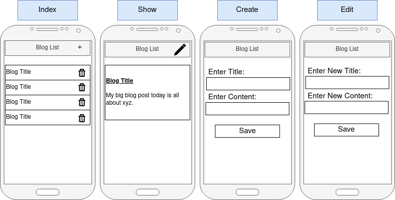
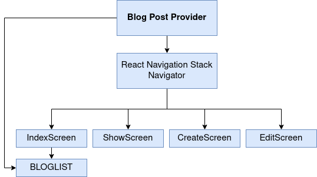
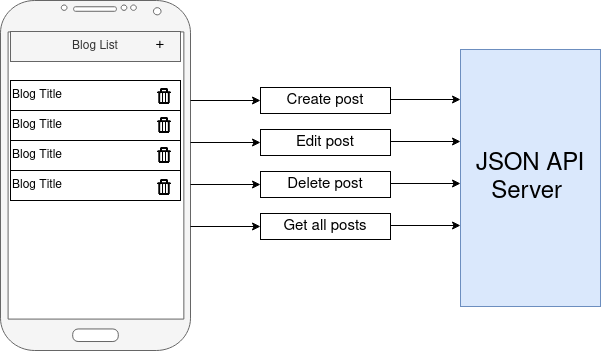
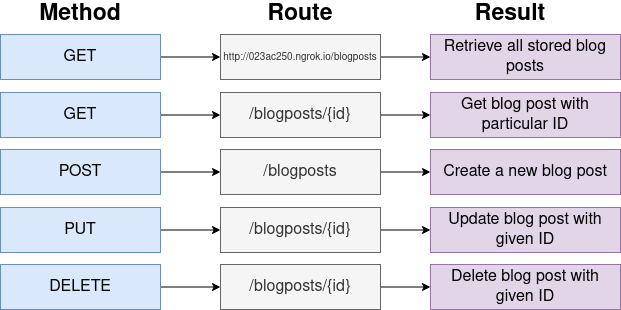
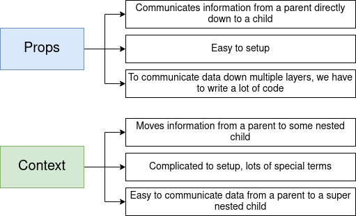
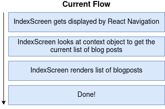
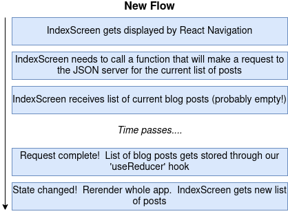

# POST+ 
CRUD App with Context provider component & JSON Server - React Native App

[DEMO at snack.expo.io](https://snack.expo.io/@webdevelop/post+)

[DEMO at appetize.io]()

[JSON Server](https://stream-json-server.herokuapp.com/)

[JSON Server with initial posts](https://stream-json-server.herokuapp.com/posts)


--------------------

##### Start the App and clear cache:
```
npm run start -c
npm run dev -c

yarn dev
```


[http://localhost:19002/](http://localhost:19002/)

--------------------

##### Fix errors:
``` 
rm -r node_modules
rm package-lock.json

expo upgrade

yarn dev
```

--------------------

#### project mockup




--------------------

#### project structure




--------------------

#### JSON Server connection




--------------------

#### HTTP requests




--------------------

#### props vs context



--------------------

#### project mockup




--------------------




--------------------
 

## [Building Standalone Apps](https://docs.expo.io/distribution/building-standalone-apps/)

``` 
// app.json

{
  "expo": {
    "name": "post-json-api",
    "slug": "post-json-api",
    "platforms": [
      "ios",
      "android",
      "web"
    ],
    "version": "1.0.0",
    "orientation": "portrait",
    "icon": "./assets/icon.png",
    "splash": {
      "image": "./assets/splash.png",
      "resizeMode": "contain",
      "backgroundColor": "#ffffff"
    },
    "updates": {
      "fallbackToCacheTimeout": 0
    },
    "assetBundlePatterns": [
      "**/*"
    ],
    "ios": {
      "supportsTablet": true,
      "bundleIdentifier": "com.yourcompany.yourappname",
      "buildNumber": "1.0.0"
    },
    "android": {
      "package": "com.yourcompany.yourappname",
      "versionCode": 1
    }
  }
}
```


``` 
cd myproject
expo start
press control c to stop the metro bundler
export EXPO_DEBUG=true
expo build:android -t app-bundle
```

``` 
expo build:android -t apk
expo build:android -t app-bundle
```

``` 
expo build:ios -t archive
expo build:ios -t simulator
```

``` 
expo build:status

...

You can monitor the build at:
 https://expo.io/dashboard/tom2kota/builds/49cfb317-...-8f5067b11b50

✔ Build finished.
Successfully built standalone app: https://expo.io/artifacts/a36ef46a-...-094058ddc907

```

 ##### Download ```.apk``` file
 
 
--------


## Run native mobile apps in your browser

[appetize.io](https://appetize.io/)

```
Current plan: Trial

Month-to-date usage: 0 sessions, 0 minutes.

You are limited to 1 concurrent user and 100 minutes of streaming per month. 
```
How to upload an app to Appetize.io? => [link](https://support.appetize.io/help/how-to-upload-an-app-to-appetize-io)


[Upload an app](https://appetize.io/upload)


For iOS, upload a ```.zip``` or ```.tar.gz ``` file containing your compressed ```.app``` bundle.

Your ```.app``` bundle must represent a simulator build of your app. After running in iOS Simulator via Xcode, look in
```~/Library/Developer/Xcode/DerivedData/<project-name>/Build/Products/Debug-iphonesimulator/```.

Alternatively, you may run ```xcodebuild -sdk iphonesimulator``` (if you use .xcodeproj)
or ```xcodebuild -sdk iphonesimulator -workspace Sample.xcworkspace/ -scheme <your-scheme> -configuration Debug``` (if you use .xcworkspace) in your project directory, then zip the ```.app``` bundle in ```build/Debug-iphonesimulator/```.

For Android, upload the ```.apk``` containing your app.

After your app is built, either via Android Studio or by running the command ```./gradlew assembleDebug``` in your project directory, look in ```<project-name>/<module-name>/build/outputs/apk/```. 

